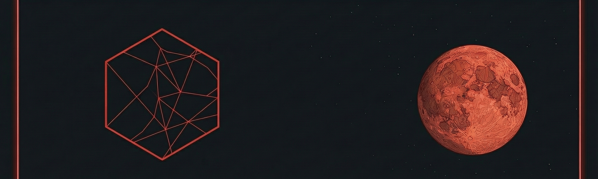

# ¡Hola! Soy Alan 👋

  

### 👨‍💻 Sobre mí

Soy estudiante de **Ingeniería de Software**, apasionado por construir soluciones tecnológicas y aprender algo nuevo cada día. 

- 🚀 Actualmente enfocado en dominar el desarrollo con **Python**, **Java** y **C++**.
- 🧠 Me interesa mucho el mundo de la **Inteligencia Artificial** y el desarrollo de videojuegos.
---

### 🛠️ Tecnologías y Herramientas

  
  
  
  
  

---
### 🏆 Logros en GitHub

  

---

### 📊 Actividad y Lenguajes

  

---
